# <ins>Introduction</ins>

This program allows the Linux Cluster Administration to view, monitor, and obtain data on nodes/servers running in the Linux cluster. This program provides resource usage in real-time which the LCA team will use the data to create reports.

The technologies that the programing is using are the following.

- Docker
    - Docker will be running postgres:9.6-alpine (PSQL), which is where we will be storing the information of each node/server.

- Bash scripts
    - The bash scripts are there to automate the creation of the docker container and obtaining and sending the data to the database.


- Crontab
    - The crontab is there to schedule the bash script to obtain the current usage of the node/server each minute.

- GitHub
    - Github is used to maintain the source code of this program.

# <ins>Quick Start</ins>

This a quick start guide to get the program up and running.

```bash
./scripts/psql_docker.sh create host password

./scripts/psql_docker.sh start

psql -h localhost -U host -f sql/ddl.sql

./scripts/host_info.sh localhost 5432 host_agent host password

crontab -e 

* * * * * bash [path]/scripts/host_usage.sh localhost 5432 host_agent username password > /tmp/host_usage.log

# wait 5 minuits to let the crontab add data to the database

psql -h localhost -p 5432 -d host_agent -U host -f /sql/queries.sql 

```


## <ins>Implemenation</ins>

- **psql_docker.sh**: This script is responsible for creating/starting/stopping the PSQL database in a docker container.
-  **host_info.sh**: This script is responsible for getting the hardware specification for the server and sending that information to the database.
- **host_usage.sh**: This script is responsible for getting the current usage of the node/server and sending that information to the database.
- **ddl.sql**: This SQL file will create the database tables required to store the data and construct the functions used for queries.
- **queres.sql**: This SQL file will have the queries needed for the LCA team to get the information on each node.
- **Crontab**: Crontab is used to schedule and execute the host_usage.sh, every minute on the node/server.


## <ins>Architecture</ins>

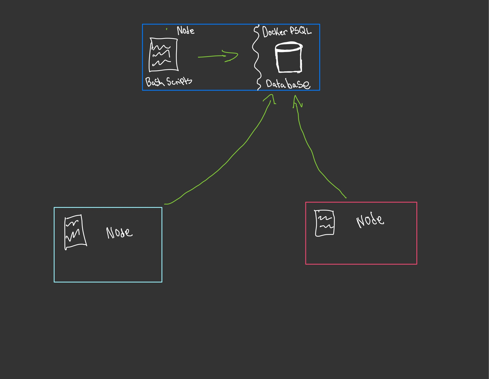

The docker container will be used to persist all the data, and it will be set to one host. In this case, the node with the dark blue box will have the docker container with the PSQL database. Each node will have the bash scripts to send data to the database.


## <ins>scripts</ins>
**&nbsp;psql_docker.sh**


<Table>
  <tr>
    <td>
      <strong>Usage</strong>
    </td>
    <td>
      <strong>Description</strong>
    </td>
    <td>
      <strong>example</strong>
    </td>
  </tr>
  <tr>
    <td> Create </td>
    <td> used to initialize the docker container. Needs username and password. </td>
    <td>

```bash
./psql_docker.sh create username password 
```
</td>


</tr>
<tr>
    <td>Start</td>
    <td>used to start the docker container</td>
    <td>

```bash
./psql_docker.sh start 
```
</td>
</tr>
<tr>
    <td>Stop</td>
    <td>used to stop the docker container</td>
    <td>

```bash
./psql_docker.sh stop
```
</td>
</tr>
</Table>

##### &nbsp;host_info.sh & host_usage.sh

Usage         | Description                                                                                 | Default|
------------- |---------------------------------------------------------------------------------------------| ----------|
psql_host     | The IP address of the contaior where the database is being hosted.                          | localhost|
psql_port     | specify the port which the server is listenting for                                         | 5432|
db_name       | specify the database name to connect to                                                     | host_agent|
psql_user     | specifiy the username to login into the psql server | (./psql_docker create **username** ...)|
psql_password | specifiy the password to login into the psql server                                         | (./psql_docker create ... **password**)|

```bash
##./host_info.sh usage/example
./host_info.sh psql_host psql_port database_name psql_username psql_password
./host_info.sh "localhost" 5432 "host_agent" "host" "password"

##./host_usage.sh usage/example
./host_usage.sh psql_host psql_port database_name psql_username psql_password
./host_usage.sh "localhost" 5432 "host_agent" "host" "password"
```
#### &nbsp;Crontab
```bash
#step 1 edit the crontab 

crontab -e 

#step 2 add the following to the crontab
#this will run the script "host_usage.sh" every 1 minute 
#and save it to a temporary file called host_usage.log

# usage example
* * * * *bash 
/[path]/scripts/host_usage.sh localhost 5432 host_agent username password
```


## <ins>DB Modeling</ins>

| host_info          | Description                                  |  
|--------------------|----------------------------------------------|
| id                 | PK used to identify the nodes on the cluster |
| cpu_number         | number of CPU cores on the node              |
| cpu_archiecture   | The architecture used by the node            |
| cpu_model          | The CPU model used by the node               |
| cpu_mhz            | The CPU clock speed used by the node         |
| L2_cache           | The CPU L2 cache memory size of the node     |
| total_mem          | The total storage on the node                |
| timestamp          | The time it was added to the database        |

| host_usage     | Description                                                |
|----------------|------------------------------------------------------------|
| timestamp      | real time of the node using it's resources                 |
| host_id        | FK of id from host_info                                    |
| memory_free    | The current free memory in the node                        |
| cpu_idle       | The current cpu idle in percentage                         |
| cpu_kernel     | The current cpu kernal in percentage                       |
| disk_io        | The number of disk io's in the node being used             |
| disk_available | The current free memory in the root dicrectory of the node |

| Function | Description                                                               |
|----------|---------------------------------------------------------------------------|
| round5   | This function returns a timestamp for an interval of 5 minutes            |
|avg_mem_perecentage| This function returns an INT of the average memory being used by the node |


# <ins>Test</ins>
The test I ran to ensure that the program was running correctly.

**Docker Script test**

- psql_docker.sh

Test: Create
```bash
  ./scripts/psql_docker.sh create 
  #test with create only
  #expected error: create requires username and password
```

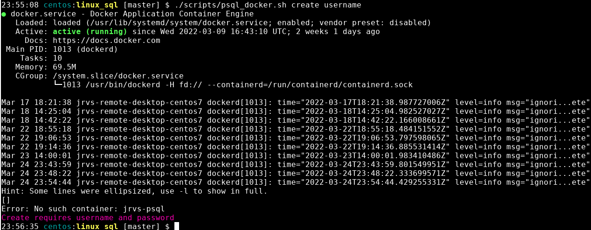

```bash
./scripts/psql_docker.sh create username
#test create with username
#expected error: create requires username and password
```


Test: Volume for docker.
```bash
./scrpits/psql_docker.sh create host password
#expected volume pgdata to be created. 
```
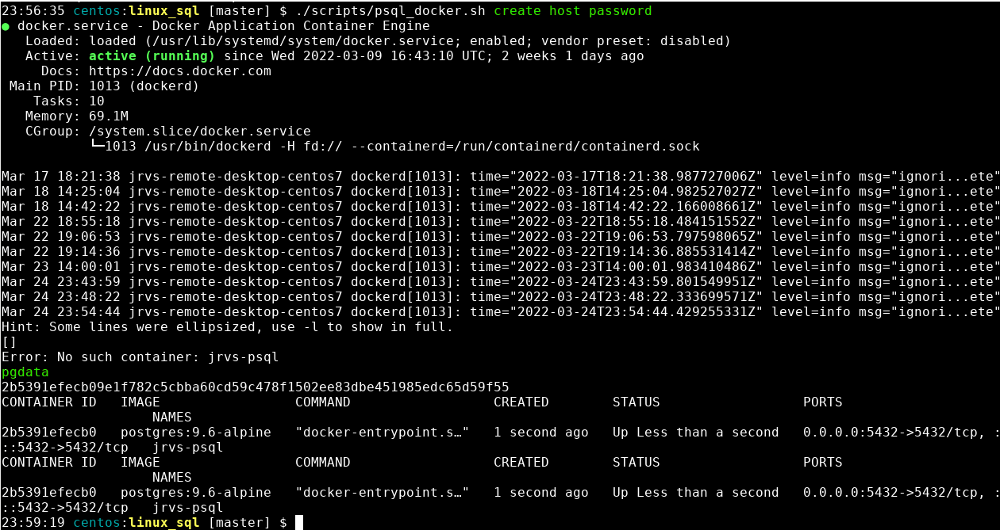
<br>
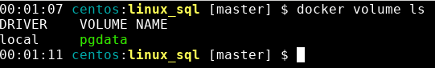
<br>
Test: Start
```bash
docker ps
#expected: No container to be running 
./scripts/psql_docker start
#expected: Script to start the container 
docker ps
#expected: Container jrvs-psql running
```

<br>
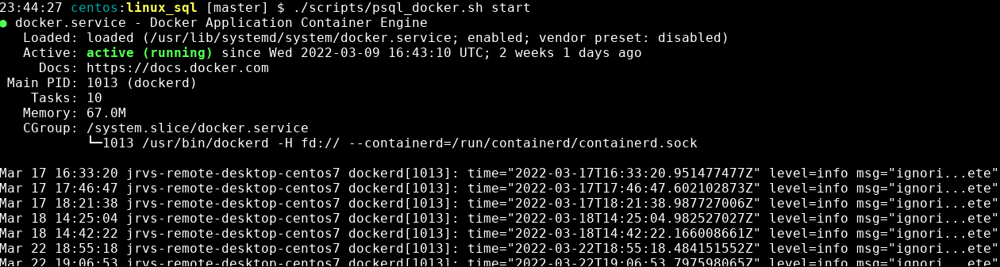
<br>
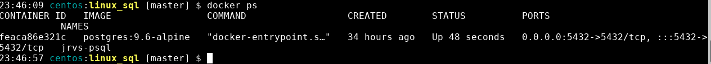

Test: Stop
```bash
docker ps
#expexcted: Container jrvs-psql running
./scripts/psql_docker.sh stop
#expected: Script to stop container jrvs-psql
docker ps -a
#expected: jrvs-psql stoped
```
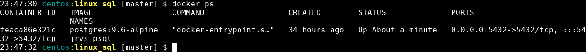
<br>
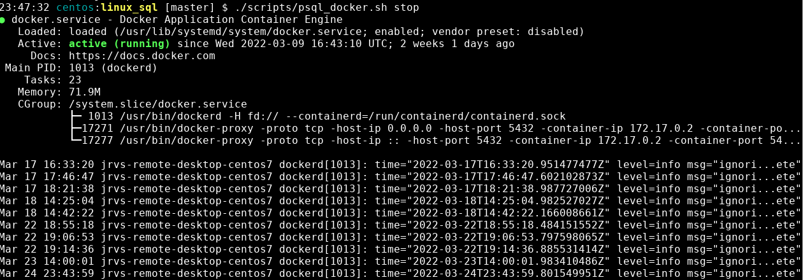
<br>
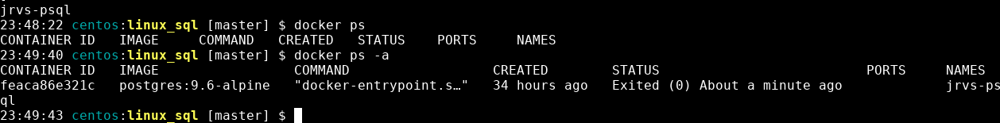


Test: The user for the PSQL was created.
```bash
psql -h localhost -U 
#connected the psql server to check that 
\du
#list all users in the psql server expecting host to be there
```

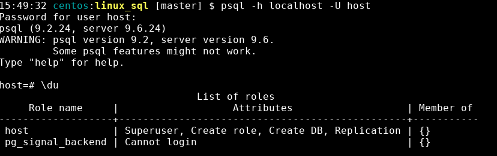

Test: Database Created.
```bash
psql -h localhost -U host -f sql/ddl.sql
#expected the sql script to build the database in host_agent
\l
#expected to see host_agent in the list of databases
```
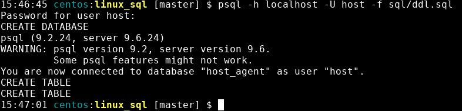
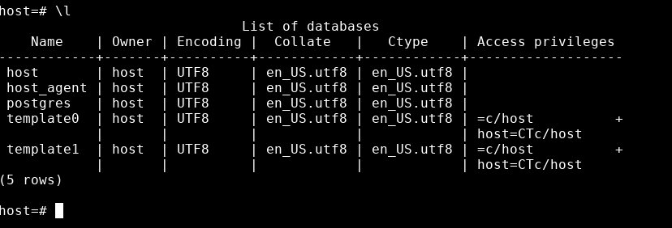


----------------------------
**host_usage/host_info**
The test I ran to ensure that host_usage and host_info were working correctly


**host_info**
Test: Confirming that the script won't run unless all parameters are correct  correctly
```bash
./scripts/host_info.sh localhost 5432 host_agent host
#expected error needs all five parameters  
```
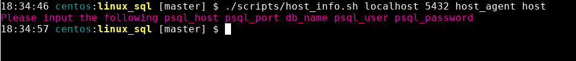


Test: host_info.sh inserted data into the database
```bash
./scripts/host_info.sh localhost 5432 host_agent host password
#expected INSERT 
psql -h localhost -U host
#connect to the psql server
\c host_agent
#connect to the host_agent database
```
```sql
SELECT * FROM host_info;
#return all rows in the host_info table, Expected 1 row. 
```
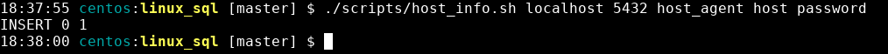

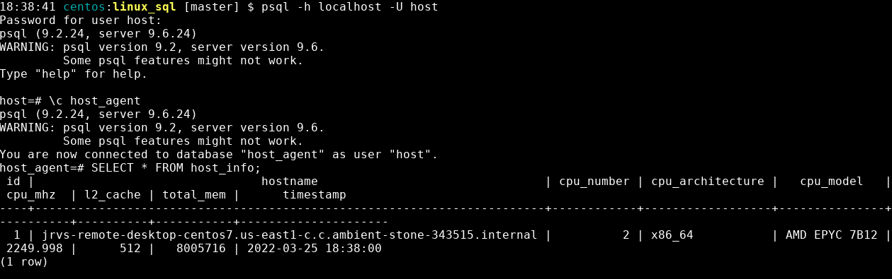


**host_usage**
Test: Confirming that the script won't run unless all parameters are correct correctly
```bash
./scripts/host_usage.sh localhost 5432 host_agent host
#expected error needs all five parameters  
```


Test: host_info.sh inserted data into the database

```bash
./scripts/host_usage.sh localhost 5432 host_agent host password
#expected INSERT 
psql -h localhost -U host
#connect to the psql server
\c host_agent
#connect to the host_agent database
```

```sql
SELECT * FROM host_usage;
#return all rows in the host_usage table, Expected 1 row. 
```


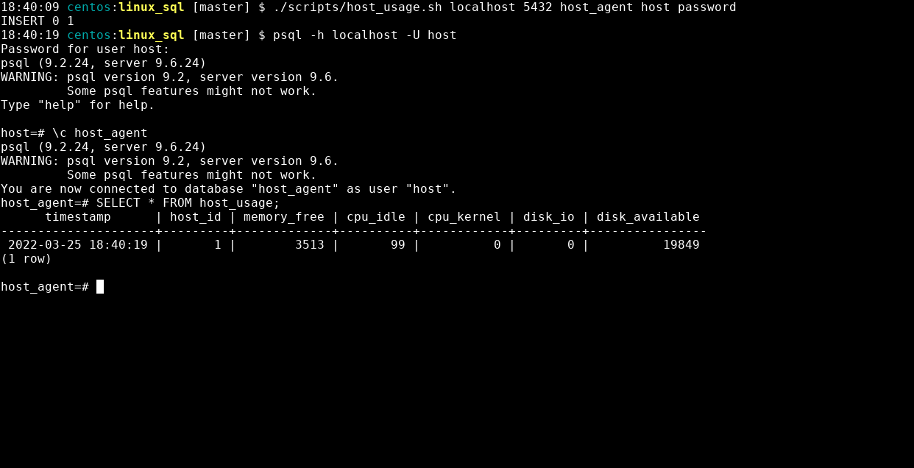

----------------------------
**Crontab**
Issues I ran with crontab:
- Services was not started
    - Fixed it by
   ```bash 
  systemctl start crond
   ```
  This ensured that the services for crontab is up and running.

To ensure that the crontab bash is working, I made sure that the script was active after adding it to the crontab

After ensuring that the crontab services are currently running. I checked the /tmp/host_usage.log exists in the /tmp/ directory. I checked the database to see if the values were inserted every minute to ensure everything was working correctly.
 ```bash 
 crontab -l 
 #This returned all the jobs that crontab is currently running. 
 ls /tmp/*log
 #expected to find host_usage.log after one minute 
 ```


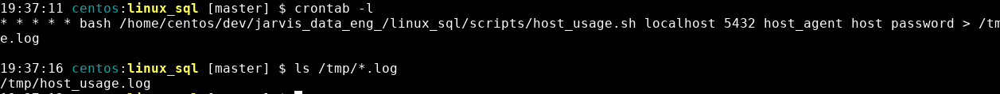


```bash
psql -h localhost -p 5432 -d host_agent -U host
```
 ```sql
SELECT * FROM host_usage; 
 ```
This returened all the values that the crontab would have inserted every minute to the PSQL database.

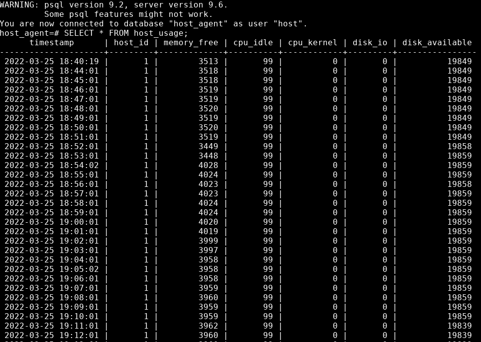

# <ins>Deplyoment</ins>
The Program is deployed using the following technologies

- Bash scripts to automate the process
-  Docker to store the data/database

- Crontab schedules the current usage of the node/server and sends the information to the database
- GitHub to maintain the source code of the program.


# <ins>Improvements</ins>

Create a backup or a database that will store the information even after destroying the docker container.

Instead of having multiple scripts to get the program to start, I would like to automate the process. The user only needs to run one script, to use the program.

